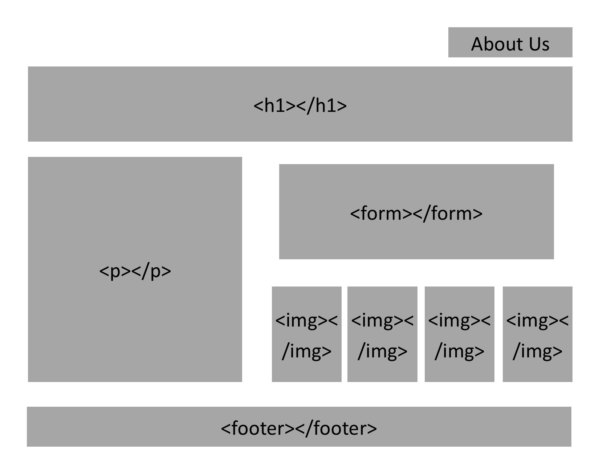
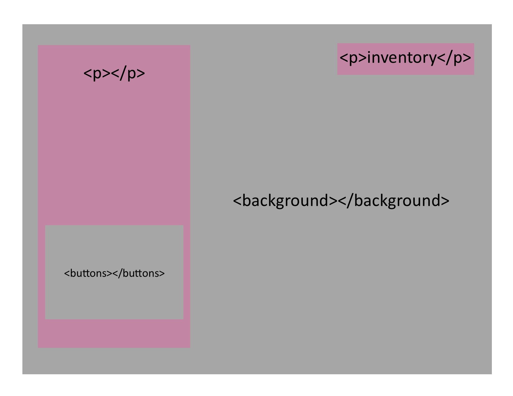
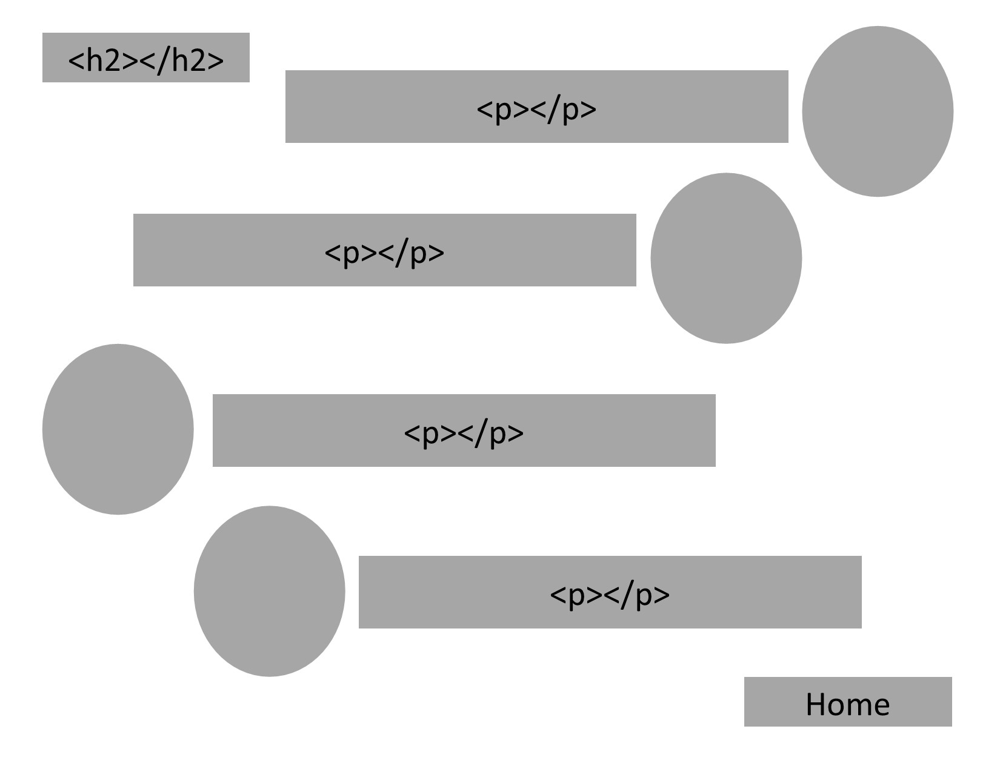

# CODE 201 PROJECT

## PROJECT NAME: ACCIO

Text based interactive fantasy game application that provides entertainment and a means to distract your mind from software development class.

**MVP:** Quest based gathering game that will take the user on an interactive scavenger hunt.

**Local Storage:** Accumulated items acquired during the quest.

## WIREFRAMES:

## USER STORIES:

- As a client, I want a text based interactive fantasy game application so that it can provide entertainment for people of all ages.

- As a client, I want a text based interactive game with a familiar reference so that users can easily identify with the theme of the application.

- As a user, I want to play an interactive fantasy game application so that I can make various choices to reach an end goal.

- As a developer, I want to create an interactive game application so that it will encourage the user to make decisions that will determine the direction of the game content. 

- As a parent, I want a game that would engage my child’s imagination so that it provides a creative outlet for independent decision making.

## DOMAIN MODEL:

### COLLABORATORS

- Stephon Knight
- Kale Lesko
- Sara Russert
- Christopher Quiocho

### Links and Resources
* [How to create a drop-down list in HTML](https://www.w3schools.com/html/html_form_elements.asp)
* [How to create a radio button in HTML](https://www.w3schools.com/tags/att_input_type_radio.asp)
* [Adding Shadow on Hover to a Button](https://www.w3schools.com/css/css3_buttons.asp)
* [Redirect a Webpage](https://www.w3schools.com/howto/howto_js_redirect_webpage.asp)
* [Harry Potter Wiki](https://harrypotter.fandom.com/wiki/Main_Page)
* [The Ballad of Nearly Headless Nick](https://harrypotter.fandom.com/wiki/The_Ballad_of_Nearly_Headless_Nick)
* [Free Usable Images and Backgrounds](https://unsplash.com/)
* [Photos Released Under Public Domain License](https://www.piqsels.com/)
* [Royalty Free Photos & Backgrounds](https://www.pickpik.com/)